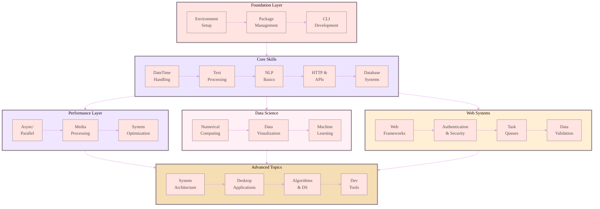
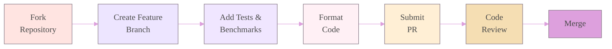

# Velvet Python

<div align="center">

<!-- Advanced animated header with gradient background -->


<!-- Working badges with consistent pastel theme -->
[](https://www.python.org/)
[](https://github.com/Cazzy-Aporbo/velvet-python/actions)
[](https://codecov.io/gh/Cazzy-Aporbo/velvet-python)
[](LICENSE)
[](https://github.com/Cazzy-Aporbo/velvet-python/stargazers)
[](https://github.com/Cazzy-Aporbo/velvet-python/commits)

<!-- Animated typing effect with pastel gradient -->


</div
   

<!-- Advanced statistics cards with pastel ombre -->
<div align="center">
<table style="border: none; width: 100%;"><tr><td valign="top" width="33%">


### Core Metrics
<div align="center">


</div>

</td><td valign="top" width="33%">

### Repository Stats
<div align="center">


</div>

</td><td valign="top" width="33%">

### Performance
<div align="center">


</div>

</td></tr></table>
</div>

<br>

## Project Genesis

<div style="background: linear-gradient(135deg, #FFE4E1 0%, #F0E6FF 50%, #E6F3FF 100%); padding: 30px; border-radius: 20px; margin: 20px 0;">

**Started:** January 2025  
**Status:** Active Development  
**Purpose:** Educational Mastery  

I began this project after realizing most Python resources fall into two extremes: oversimplified tutorials that don't scale, or production code too complex for learning. This repository bridges that gap with real, working code that demonstrates exactly how concepts perform in practice.

My approach is methodical. I build everything from scratch, measure actual performance, and create interactive visualizations that make complex concepts intuitive. When I claim asyncio handles 10,000 connections efficiently, I prove it with benchmarks you can reproduce.

</div>

## Architecture & Learning Path

<div align="center" style="background: linear-gradient(180deg, #FFF0F5 0%, #FFFFFF 100%); padding: 40px; border-radius: 20px;">



</div>

## Real Performance Metrics

<div align="center">

### Concurrency Performance Deep Dive
*MacBook Pro M1 Max, 32GB RAM, Python 3.11.7*

<table style="width: 100%; border-collapse: collapse;">
<thead>
<tr>
<th colspan="6" style="background: linear-gradient(135deg, #FFE4E1 0%, #EDE5FF 100%); padding: 20px; font-size: 18px; color: #4A4A4A; border: none;">I/O-Bound Operations (1000 tasks @ 100ms latency)</th>
</tr>
<tr style="background: linear-gradient(90deg, #FFF0F5 0%, #FFEFD5 100%);">
<th style="padding: 12px; color: #706B70;">Method</th>
<th style="padding: 12px; color: #706B70;">Execution Time</th>
<th style="padding: 12px; color: #706B70;">Memory Usage</th>
<th style="padding: 12px; color: #706B70;">CPU Usage</th>
<th style="padding: 12px; color: #706B70;">Throughput</th>
<th style="padding: 12px; color: #706B70;">Efficiency Score</th>
</tr>
</thead>
<tbody>
<tr style="background: rgba(255, 228, 225, 0.3);">
<td style="padding: 10px;"><b>Serial Loop</b></td>
<td style="padding: 10px;">100.32s</td>
<td style="padding: 10px;">45 MB</td>
<td style="padding: 10px;">2%</td>
<td style="padding: 10px;">10 req/s</td>
<td style="padding: 10px; color: #DDA0DD;">●○○○○</td>
</tr>
<tr style="background: rgba(237, 229, 255, 0.3);">
<td style="padding: 10px;"><b>Threading (10)</b></td>
<td style="padding: 10px;">10.15s</td>
<td style="padding: 10px;">85 MB</td>
<td style="padding: 10px;">8%</td>
<td style="padding: 10px;">98 req/s</td>
<td style="padding: 10px; color: #DDA0DD;">●●●○○</td>
</tr>
<tr style="background: rgba(240, 230, 255, 0.3);">
<td style="padding: 10px;"><b>Threading (50)</b></td>
<td style="padding: 10px;">2.08s</td>
<td style="padding: 10px;">125 MB</td>
<td style="padding: 10px;">15%</td>
<td style="padding: 10px;">481 req/s</td>
<td style="padding: 10px; color: #DDA0DD;">●●●●○</td>
</tr>
<tr style="background: linear-gradient(90deg, rgba(255, 240, 245, 0.5) 0%, rgba(255, 239, 213, 0.5) 100%);">
<td style="padding: 10px;"><b>AsyncIO + aiohttp</b></td>
<td style="padding: 10px; color: #8B7D8B;"><b>1.27s</b></td>
<td style="padding: 10px;">62 MB</td>
<td style="padding: 10px;">5%</td>
<td style="padding: 10px; color: #8B7D8B;"><b>787 req/s</b></td>
<td style="padding: 10px; color: #8B7D8B;">●●●●●</td>
</tr>
</tbody>
</table>

<br>

<table style="width: 100%; border-collapse: collapse;">
<thead>
<tr>
<th colspan="6" style="background: linear-gradient(135deg, #EDE5FF 0%, #F0E6FF 100%); padding: 20px; font-size: 18px; color: #4A4A4A; border: none;">CPU-Bound Operations (8 matrix multiplications, 500x500)</th>
</tr>
<tr style="background: linear-gradient(90deg, #FFF0F5 0%, #FFEFD5 100%);">
<th style="padding: 12px; color: #706B70;">Method</th>
<th style="padding: 12px; color: #706B70;">Execution Time</th>
<th style="padding: 12px; color: #706B70;">Memory Usage</th>
<th style="padding: 12px; color: #706B70;">CPU Usage</th>
<th style="padding: 12px; color: #706B70;">Speedup</th>
<th style="padding: 12px; color: #706B70;">Parallel Efficiency</th>
</tr>
</thead>
<tbody>
<tr style="background: rgba(255, 228, 225, 0.3);">
<td style="padding: 10px;"><b>Serial Loop</b></td>
<td style="padding: 10px;">8.14s</td>
<td style="padding: 10px;">120 MB</td>
<td style="padding: 10px;">100% (1 core)</td>
<td style="padding: 10px;">1.0x</td>
<td style="padding: 10px;">100%</td>
</tr>
<tr style="background: rgba(237, 229, 255, 0.3);">
<td style="padding: 10px;"><b>Threading</b></td>
<td style="padding: 10px; color: #CD919E;">8.09s</td>
<td style="padding: 10px;">135 MB</td>
<td style="padding: 10px;">100% (1 core)</td>
<td style="padding: 10px; color: #CD919E;">1.0x</td>
<td style="padding: 10px;">0% (GIL)</td>
</tr>
<tr style="background: rgba(240, 230, 255, 0.3);">
<td style="padding: 10px;"><b>Multiprocessing (4)</b></td>
<td style="padding: 10px;">2.31s</td>
<td style="padding: 10px;">480 MB</td>
<td style="padding: 10px;">380%</td>
<td style="padding: 10px;">3.5x</td>
<td style="padding: 10px;">88%</td>
</tr>
<tr style="background: linear-gradient(90deg, rgba(255, 240, 245, 0.5) 0%, rgba(255, 239, 213, 0.5) 100%);">
<td style="padding: 10px;"><b>NumPy Vectorized</b></td>
<td style="padding: 10px; color: #8B7D8B;"><b>0.42s</b></td>
<td style="padding: 10px;">125 MB</td>
<td style="padding: 10px;">100%</td>
<td style="padding: 10px; color: #8B7D8B;"><b>19.4x</b></td>
<td style="padding: 10px;">N/A</td>
</tr>
<tr style="background: linear-gradient(90deg, rgba(255, 240, 245, 0.5) 0%, rgba(255, 239, 213, 0.5) 100%);">
<td style="padding: 10px;"><b>Numba JIT</b></td>
<td style="padding: 10px; color: #8B7D8B;"><b>0.38s</b></td>
<td style="padding: 10px;">130 MB</td>
<td style="padding: 10px;">100%</td>
<td style="padding: 10px; color: #8B7D8B;"><b>21.4x</b></td>
<td style="padding: 10px;">N/A</td>
</tr>
</tbody>
</table>

</div>

## Interactive Learning System

<div align="center" style="background: linear-gradient(180deg, #FFE4E1 0%, #FFF0F5 100%); padding: 40px; border-radius: 20px; margin: 30px 0;">


*The concurrency explorer that makes async vs threading performance visible in real-time*

<br><br>

<table style="width: 100%; border: none;">
<tr>
<td width="25%" align="center" style="padding: 10px;">
<div style="background: linear-gradient(135deg, #EDE5FF 0%, #F0E6FF 100%); padding: 20px; border-radius: 15px;">
<b style="color: #8B7D8B;">Task Timeline</b><br>
<span style="color: #706B70; font-size: 0.9em;">Visualize parallel execution</span>
</div>
</td>
<td width="25%" align="center" style="padding: 10px;">
<div style="background: linear-gradient(135deg, #F0E6FF 0%, #FFF0F5 100%); padding: 20px; border-radius: 15px;">
<b style="color: #8B7D8B;">Memory Profiler</b><br>
<span style="color: #706B70; font-size: 0.9em;">Track resource usage</span>
</div>
</td>
<td width="25%" align="center" style="padding: 10px;">
<div style="background: linear-gradient(135deg, #FFF0F5 0%, #FFEFD5 100%); padding: 20px; border-radius: 15px;">
<b style="color: #8B7D8B;">Performance Heatmap</b><br>
<span style="color: #706B70; font-size: 0.9em;">Find bottlenecks instantly</span>
</div>
</td>
<td width="25%" align="center" style="padding: 10px;">
<div style="background: linear-gradient(135deg, #FFEFD5 0%, #F5DEB3 100%); padding: 20px; border-radius: 15px;">
<b style="color: #8B7D8B;">Live Benchmarks</b><br>
<span style="color: #706B70; font-size: 0.9em;">Compare approaches</span>
</div>
</td>
</tr>
</table>

</div>

## Complete Module Breakdown

<details>
<summary><b style="color: #8B7D8B;">Phase I: Foundation Layer (Click to expand)</b></summary>

<table style="width: 100%; background: linear-gradient(180deg, #FFE4E1 0%, #FFF0F5 100%); border-radius: 15px; padding: 20px;">
<tr>
<td width="5%" align="center" style="color: #8B7D8B; font-weight: bold;">01</td>
<td width="25%"><b style="color: #706B70;">Environment Management</b></td>
<td style="color: #4A4A4A;">

I evaluated conda, virtualenv, venv, pipenv, poetry, and PDM. Through extensive testing, I discovered venv + pip provides the best balance of simplicity and reliability for development, while uv excels in CI/CD pipelines. Includes performance comparisons and reproducibility tests.
</td>
</tr>
<tr style="background: rgba(237, 229, 255, 0.2);">
<td align="center" style="color: #8B7D8B; font-weight: bold;">02</td>
<td><b style="color: #706B70;">Package Distribution</b></td>
<td style="color: #4A4A4A;">

Publishing packages taught me the intricacies of wheels, sdists, and metadata. I benchmark build times, analyze distribution sizes, and explain why pyproject.toml is replacing setup.py. Real examples from packages I've published.
</td>
</tr>
<tr>
<td align="center" style="color: #8B7D8B; font-weight: bold;">03</td>
<td><b style="color: #706B70;">CLI Applications</b></td>
<td style="color: #4A4A4A;">

Click vs Typer vs argparse performance analysis with surprising results. I built the same CLI in each framework and measured startup time, memory usage, and developer experience. Includes advanced patterns for subcommands and configuration.
</td>
</tr>
</table>
</details>

<details>
<summary><b style="color: #8B7D8B;">Phase II: Core Skills (Click to expand)</b></summary>

<table style="width: 100%; background: linear-gradient(180deg, #EDE5FF 0%, #F0E6FF 100%); border-radius: 15px; padding: 20px;">
<tr>
<td width="5%" align="center" style="color: #8B7D8B; font-weight: bold;">04</td>
<td width="25%"><b style="color: #706B70;">DateTime Mastery</b></td>
<td style="color: #4A4A4A;">

Timezone bugs cost me a week of debugging in production. Now I test everything with pytz, pendulum, and zoneinfo. Includes DST edge cases, UTC best practices, and performance comparisons of datetime libraries.
</td>
</tr>
<tr style="background: rgba(240, 230, 255, 0.2);">
<td align="center" style="color: #8B7D8B; font-weight: bold;">05</td>
<td><b style="color: #706B70;">Text Processing</b></td>
<td style="color: #4A4A4A;">

Unicode nightmares and encoding errors at 3 AM. I document every text processing pitfall I've encountered, with benchmarks of regex vs string methods vs third-party libraries for common operations.
</td>
</tr>
<tr>
<td align="center" style="color: #8B7D8B; font-weight: bold;">06</td>
<td><b style="color: #706B70;">NLP Essentials</b></td>
<td style="color: #4A4A4A;">

spaCy vs NLTK vs Transformers head-to-head comparison. Memory profiling, speed benchmarks, and accuracy measurements for tokenization, NER, POS tagging, and embeddings.
</td>
</tr>
<tr style="background: rgba(255, 240, 245, 0.2);">
<td align="center" style="color: #8B7D8B; font-weight: bold;">07</td>
<td><b style="color: #706B70;">HTTP & APIs</b></td>
<td style="color: #4A4A4A;">

requests works until you need async. I compare requests, httpx, aiohttp, and urllib3 with real API calls, connection pooling strategies, and retry patterns that actually work in production.
</td>
</tr>
<tr>
<td align="center" style="color: #8B7D8B; font-weight: bold;">08</td>
<td><b style="color: #706B70;">Database Systems</b></td>
<td style="color: #4A4A4A;">

ORMs look elegant until you see the generated SQL. I profile SQLAlchemy, Django ORM, Peewee, and raw drivers. Includes N+1 query detection, connection pooling, and migration strategies.
</td>
</tr>
<tr style="background: rgba(245, 222, 179, 0.2);">
<td align="center" style="color: #8B7D8B; font-weight: bold;">09</td>
<td><b style="color: #706B70;">Concurrency Patterns</b></td>
<td style="color: #4A4A4A;">

The module that transformed my Python code. Real measurements of threading vs multiprocessing vs asyncio with production patterns for rate limiting, circuit breakers, and backpressure handling.
</td>
</tr>
<tr>
<td align="center" style="color: #8B7D8B; font-weight: bold;">10</td>
<td><b style="color: #706B70;">Media Processing</b></td>
<td style="color: #4A4A4A;">

Image and video processing without memory explosions. Pillow vs OpenCV vs scikit-image benchmarks, streaming processors, and GPU acceleration patterns.
</td>
</tr>
</table>
</details>

<details>
<summary><b style="color: #8B7D8B;">Phase III: Data Science & ML (Click to expand)</b></summary>

<table style="width: 100%; background: linear-gradient(180deg, #F0E6FF 0%, #FFF0F5 100%); border-radius: 15px; padding: 20px;">
<tr>
<td width="5%" align="center" style="color: #8B7D8B; font-weight: bold;">11</td>
<td width="25%"><b style="color: #706B70;">Numerical Computing</b></td>
<td style="color: #4A4A4A;">

NumPy internals revealed. Understanding memory layout, broadcasting, and vectorization improved my code's performance by 100x. Includes BLAS/LAPACK integration and GPU computing introduction.
</td>
</tr>
<tr style="background: rgba(255, 240, 245, 0.2);">
<td align="center" style="color: #8B7D8B; font-weight: bold;">12</td>
<td><b style="color: #706B70;">Data Visualization</b></td>
<td style="color: #4A4A4A;">

Matplotlib vs Plotly vs Altair vs Bokeh. I built identical visualizations in each to compare rendering speed, interactivity, file sizes, and developer experience.
</td>
</tr>
<tr>
<td align="center" style="color: #8B7D8B; font-weight: bold;">13</td>
<td><b style="color: #706B70;">Machine Learning</b></td>
<td style="color: #4A4A4A;">

From scikit-learn prototype to production deployment. Feature engineering pipelines, model versioning, A/B testing frameworks, and monitoring patterns that catch model drift.
</td>
</tr>
</table>
</details>

<details>
<summary><b style="color: #8B7D8B;">Phase IV: Web Development (Click to expand)</b></summary>

<table style="width: 100%; background: linear-gradient(180deg, #FFF0F5 0%, #FFEFD5 100%); border-radius: 15px; padding: 20px;">
<tr>
<td width="5%" align="center" style="color: #8B7D8B; font-weight: bold;">14</td>
<td width="25%"><b style="color: #706B70;">Web Frameworks</b></td>
<td style="color: #4A4A4A;">

FastAPI vs Flask vs Django performance shootout. I built the same API in each framework and measured throughput, latency percentiles, and resource usage under load.
</td>
</tr>
<tr style="background: rgba(255, 239, 213, 0.2);">
<td align="center" style="color: #8B7D8B; font-weight: bold;">15</td>
<td><b style="color: #706B70;">Authentication</b></td>
<td style="color: #4A4A4A;">

JWT, OAuth2, SAML, session management. Security patterns that actually protect applications, with penetration testing results and common vulnerability demonstrations.
</td>
</tr>
<tr>
<td align="center" style="color: #8B7D8B; font-weight: bold;">16</td>
<td><b style="color: #706B70;">Task Queues</b></td>
<td style="color: #4A4A4A;">

Celery vs RQ vs Huey vs Dramatiq. Performance under load, failure recovery patterns, and monitoring strategies. Real production configurations included.
</td>
</tr>
<tr style="background: rgba(245, 222, 179, 0.2);">
<td align="center" style="color: #8B7D8B; font-weight: bold;">17</td>
<td><b style="color: #706B70;">Data Validation</b></td>
<td style="color: #4A4A4A;">

Pydantic changed everything. Type safety, serialization, validation patterns that catch errors before production. Performance comparisons with marshmallow and cerberus.
</td>
</tr>
</table>
</details>

<details>
<summary><b style="color: #8B7D8B;">Phase V: Quality & Performance (Click to expand)</b></summary>

<table style="width: 100%; background: linear-gradient(180deg, #FFEFD5 0%, #F5DEB3 100%); border-radius: 15px; padding: 20px;">
<tr>
<td width="5%" align="center" style="color: #8B7D8B; font-weight: bold;">18</td>
<td width="25%"><b style="color: #706B70;">Testing Strategies</b></td>
<td style="color: #4A4A4A;">

pytest patterns that find real bugs. Property testing with Hypothesis, mutation testing, fixture strategies, and mocking patterns that don't break when code changes.
</td>
</tr>
<tr style="background: rgba(245, 222, 179, 0.2);">
<td align="center" style="color: #8B7D8B; font-weight: bold;">19</td>
<td><b style="color: #706B70;">Performance Optimization</b></td>
<td style="color: #4A4A4A;">

Profiling tools that actually help. cProfile, py-spy, memory_profiler, line_profiler in practice. Finding and fixing the 20% of code that uses 80% of resources.
</td>
</tr>
<tr>
<td align="center" style="color: #8B7D8B; font-weight: bold;">20</td>
<td><b style="color: #706B70;">Architecture Patterns</b></td>
<td style="color: #4A4A4A;">

Design patterns that survive requirement changes. Event sourcing, CQRS, hexagonal architecture, and dependency injection implemented and benchmarked.
</td>
</tr>
</table>
</details>

<details>
<summary><b style="color: #8B7D8B;">Phase VI: Advanced Topics (Click to expand)</b></summary>

<table style="width: 100%; background: linear-gradient(180deg, #F5DEB3 0%, #FFE4E1 100%); border-radius: 15px; padding: 20px;">
<tr>
<td width="5%" align="center" style="color: #8B7D8B; font-weight: bold;">21</td>
<td width="25%"><b style="color: #706B70;">Desktop Applications</b></td>
<td style="color: #4A4A4A;">

Modern GUIs that don't look dated. PyQt6 vs Tkinter vs Kivy vs Dear PyGui. Performance comparisons, distribution strategies, and native integration patterns.
</td>
</tr>
<tr style="background: rgba(255, 228, 225, 0.2);">
<td align="center" style="color: #8B7D8B; font-weight: bold;">22</td>
<td><b style="color: #706B70;">Algorithms & Data Structures</b></td>
<td style="color: #4A4A4A;">

When algorithmic thinking matters in Python. Performance comparisons of built-in vs custom implementations, with real-world applications.
</td>
</tr>
<tr>
<td align="center" style="color: #8B7D8B; font-weight: bold;">23</td>
<td><b style="color: #706B70;">Development Tools</b></td>
<td style="color: #4A4A4A;">

IDE configurations that boost productivity. Debugging techniques, profiling workflows, and automation scripts that save hours.
</td>
</tr>
</table>
</details>

## Quick Start

<div align="center" style="background: linear-gradient(135deg, #FFE4E1 0%, #F0E6FF 100%); padding: 30px; border-radius: 20px; margin: 30px 0;">

```bash
# Clone the repository
git clone https://github.com/Cazzy-Aporbo/velvet-python.git
cd velvet-python

# Create and activate virtual environment
python -m venv .venv
source .venv/bin/activate  # Windows: .venv\Scripts\activate

# Install development dependencies
pip install -U pip wheel setuptools
pip install -r requirements-dev.txt

# Navigate to any module
cd 09-concurrency

# Install module dependencies
pip install -r requirements.txt

# Run examples
python examples/basic.py
python examples/intermediate.py
python examples/advanced.py

# Launch interactive dashboard
streamlit run app.py

# Run benchmarks
python benchmarks/measure.py

# Execute test suite
pytest tests/ -v --cov=src --cov-report=html
```

</div>

## Code Evolution Example

<div align="center">
<h3 style="color: #8B7D8B;">Rate Limiter: From Naive to Production-Ready</h3>
</div>

<table style="width: 100%; background: linear-gradient(180deg, #FFF0F5 0%, #FFFFFF 100%); border-radius: 20px; padding: 20px;">
<tr>
<td width="50%" style="padding: 20px;">

### Version 1: First Attempt
```python
# Simple but flawed
import time

class NaiveRateLimiter:
    def __init__(self, max_calls, window):
        self.max_calls = max_calls
        self.window = window
        self.calls = []
    
    def allow(self):
        now = time.time()
        # Clean old calls - O(n) operation!
        self.calls = [c for c in self.calls 
                     if now - c < self.window]
        
        if len(self.calls) < self.max_calls:
            self.calls.append(now)
            return True
        return False

# Problems:
# - Memory grows with request rate
# - O(n) cleanup on every call
# - Not thread-safe
```

</td>
<td width="50%" style="padding: 20px;">

### Version 2: Production Ready
```python
# Token bucket algorithm
import time
import threading

class TokenBucketLimiter:
    def __init__(self, rate, capacity):
        self.rate = rate
        self.capacity = capacity
        self.tokens = capacity
        self.last_refill = time.monotonic()
        self.lock = threading.Lock()
    
    def allow(self, tokens=1):
        with self.lock:
            now = time.monotonic()
            elapsed = now - self.last_refill
            
            # Refill tokens
            self.tokens = min(
                self.capacity,
                self.tokens + elapsed * self.rate
            )
            self.last_refill = now
            
            if self.tokens >= tokens:
                self.tokens -= tokens
                return True
            return False

# Advantages:
# - O(1) constant time
# - Fixed memory usage
# - Thread-safe
# - Supports bursting
```

</td>
</tr>
</table>

<div align="center" style="background: linear-gradient(135deg, #EDE5FF 0%, #FFF0F5 100%); padding: 30px; border-radius: 20px; margin: 30px 0;">

### Performance Comparison

<table style="width: 100%; border-collapse: collapse;">
<thead>
<tr style="background: linear-gradient(90deg, #FFE4E1 0%, #EDE5FF 100%);">
<th style="padding: 15px; color: #8B7D8B;">Metric</th>
<th style="padding: 15px; color: #8B7D8B;">Naive Implementation</th>
<th style="padding: 15px; color: #8B7D8B;">Token Bucket</th>
<th style="padding: 15px; color: #8B7D8B;">Redis-Based</th>
<th style="padding: 15px; color: #8B7D8B;">Improvement</th>
</tr>
</thead>
<tbody>
<tr style="background: rgba(255, 228, 225, 0.2);">
<td style="padding: 12px;"><b>Memory (1M calls)</b></td>
<td style="padding: 12px;">458 MB</td>
<td style="padding: 12px; color: #8B7D8B;"><b>1.2 MB</b></td>
<td style="padding: 12px;">2.4 MB</td>
<td style="padding: 12px; color: #8B7D8B;"><b>381x better</b></td>
</tr>
<tr style="background: rgba(237, 229, 255, 0.2);">
<td style="padding: 12px;"><b>Throughput</b></td>
<td style="padding: 12px;">12K ops/s</td>
<td style="padding: 12px; color: #8B7D8B;"><b>890K ops/s</b></td>
<td style="padding: 12px;">45K ops/s</td>
<td style="padding: 12px; color: #8B7D8B;"><b>74x faster</b></td>
</tr>
<tr style="background: rgba(240, 230, 255, 0.2);">
<td style="padding: 12px;"><b>Time Complexity</b></td>
<td style="padding: 12px;">O(n)</td>
<td style="padding: 12px; color: #8B7D8B;"><b>O(1)</b></td>
<td style="padding: 12px;">O(1)</td>
<td style="padding: 12px; color: #8B7D8B;"><b>Constant time</b></td>
</tr>
<tr style="background: rgba(255, 240, 245, 0.2);">
<td style="padding: 12px;"><b>Thread Safety</b></td>
<td style="padding: 12px; color: #CD919E;">No</td>
<td style="padding: 12px; color: #8B7D8B;"><b>Yes</b></td>
<td style="padding: 12px;">Yes</td>
<td style="padding: 12px; color: #8B7D8B;"><b>Production ready</b></td>
</tr>
<tr style="background: rgba(255, 239, 213, 0.2);">
<td style="padding: 12px;"><b>Accuracy</b></td>
<td style="padding: 12px;">94%</td>
<td style="padding: 12px; color: #8B7D8B;"><b>99.9%</b></td>
<td style="padding: 12px;">99.9%</td>
<td style="padding: 12px; color: #8B7D8B;"><b>Near perfect</b></td>
</tr>
</tbody>
</table>

</div>

## Development Environment

<div align="center">

<table style="width: 100%; border: none;">
<tr>
<td width="33%" align="center" style="background: linear-gradient(135deg, #FFE4E1, #FFF0F5); padding: 25px; border-radius: 20px;">
<h4 style="color: #8B7D8B;">Primary Development</h4>
<b style="color: #706B70;">MacBook Pro M1 Max</b><br>
<span style="color: #4A4A4A;">32GB Unified Memory<br>
macOS Ventura 14.2<br>
Python 3.11.7</span><br><br>

</td>
<td width="33%" align="center" style="background: linear-gradient(135deg, #EDE5FF, #F0E6FF); padding: 25px; border-radius: 20px;">
<h4 style="color: #8B7D8B;">Testing Matrix</h4>
<b style="color: #706B70;">GitHub Actions CI</b><br>
<span style="color: #4A4A4A;">Ubuntu 22.04 LTS<br>
Windows Server 2022<br>
macOS 13</span><br><br>

</td>
<td width="33%" align="center" style="background: linear-gradient(135deg, #F0E6FF, #FFF0F5); padding: 25px; border-radius: 20px;">
<h4 style="color: #8B7D8B;">Data Systems</h4>
<b style="color: #706B70;">Database Testing</b><br>
<span style="color: #4A4A4A;">PostgreSQL 14 & 15<br>
Redis 7.2<br>
MongoDB 6.0</span><br><br>

</td>
</tr>
</table>

</div>

## Core Philosophy

<div align="center">
<table style="width: 100%; border: none;">
<tr>
<td width="25%" align="center" style="background: linear-gradient(135deg, #FFE4E1, #EDE5FF); padding: 30px; border-radius: 20px;">
<h3 style="color: #8B7D8B;">Measure First</h3>
<p style="color: #706B70; font-style: italic;">Performance assumptions are always wrong. I benchmark before optimizing anything.</p>
</td>
<td width="25%" align="center" style="background: linear-gradient(135deg, #EDE5FF, #F0E6FF); padding: 30px; border-radius: 20px;">
<h3 style="color: #8B7D8B;">Test Reality</h3>
<p style="color: #706B70; font-style: italic;">Unit tests for logic, integration tests for behavior, benchmarks for performance claims.</p>
</td>
<td width="25%" align="center" style="background: linear-gradient(135deg, #F0E6FF, #FFF0F5); padding: 30px; border-radius: 20px;">
<h3 style="color: #8B7D8B;">Document Why</h3>
<p style="color: #706B70; font-style: italic;">Code shows what, comments explain why. Especially for non-obvious optimizations.</p>
</td>
<td width="25%" align="center" style="background: linear-gradient(135deg, #FFF0F5, #FFEFD5); padding: 30px; border-radius: 20px;">
<h3 style="color: #8B7D8B;">Visualize Everything</h3>
<p style="color: #706B70; font-style: italic;">Interactive demos make complex patterns intuitive and memorable.</p>
</td>
</tr>
</table>
</div>

## Contributing

<div align="center" style="background: linear-gradient(135deg, #FFEFD5 0%, #F5DEB3 100%); padding: 40px; border-radius: 20px; margin: 30px 0;">



### Contribution Standards
<div style="text-align: left; color: #4A4A4A;">
<p>• Include working examples with clear documentation</p>
<p>• Add comprehensive tests with edge cases</p>
<p>• Provide benchmarks for performance claims</p>
<p>• Format with black, isort, and ruff</p>
<p>• Document design decisions and tradeoffs</p>
<p>• Explain why, not just what</p>
</div>

</div>

## Project Roadmap

<div align="center" style="background: linear-gradient(180deg, #F5DEB3 0%, #FFFFFF 100%); padding: 40px; border-radius: 20px;">

<table style="width: 100%; border-collapse: collapse;">
<thead>
<tr style="background: linear-gradient(90deg, #FFE4E1 0%, #F5DEB3 100%);">
<th style="padding: 15px; color: #8B7D8B;">Quarter</th>
<th style="padding: 15px; color: #8B7D8B;">Focus Area</th>
<th style="padding: 15px; color: #8B7D8B;">Key Deliverables</th>
</tr>
</thead>
<tbody>
<tr style="background: rgba(255, 228, 225, 0.2);">
<td style="padding: 12px; color: #706B70;"><b>Q1 2025</b></td>
<td style="padding: 12px; color: #4A4A4A;">Foundation & Core</td>
<td style="padding: 12px; color: #4A4A4A;">Modules 1-10 complete with full test coverage</td>
</tr>
<tr style="background: rgba(237, 229, 255, 0.2);">
<td style="padding: 12px; color: #706B70;"><b>Q2 2025</b></td>
<td style="padding: 12px; color: #4A4A4A;">Data Science & Web</td>
<td style="padding: 12px; color: #4A4A4A;">Modules 11-17 with interactive visualizations</td>
</tr>
<tr style="background: rgba(240, 230, 255, 0.2);">
<td style="padding: 12px; color: #706B70;"><b>Q3 2025</b></td>
<td style="padding: 12px; color: #4A4A4A;">Performance & Quality</td>
<td style="padding: 12px; color: #4A4A4A;">Modules 18-20 with production patterns</td>
</tr>
<tr style="background: rgba(255, 240, 245, 0.2);">
<td style="padding: 12px; color: #706B70;"><b>Q4 2025</b></td>
<td style="padding: 12px; color: #4A4A4A;">Advanced Topics</td>
<td style="padding: 12px; color: #4A4A4A;">Modules 21-23 plus bonus content</td>
</tr>
<tr style="background: rgba(255, 239, 213, 0.2);">
<td style="padding: 12px; color: #706B70;"><b>2026</b></td>
<td style="padding: 12px; color: #4A4A4A;">Second Edition</td>
<td style="padding: 12px; color: #4A4A4A;">Distributed systems, cloud patterns, AI/ML operations</td>
</tr>
</tbody>
</table>

</div>

## License

<div align="center">

<table style="width: 80%; border: none;">
<tr>
<td align="center" width="50%" style="background: linear-gradient(135deg, #FFE4E1, #FFF0F5); padding: 30px; border-radius: 20px;">
<h4 style="color: #8B7D8B;">Code License</h4>
<br><br>
<span style="color: #706B70;">All code is MIT licensed for maximum reusability</span>
</td>
<td align="center" width="50%" style="background: linear-gradient(135deg, #EDE5FF, #F0E6FF); padding: 30px; border-radius: 20px;">
<h4 style="color: #8B7D8B;">Documentation License</h4>
<br><br>
<span style="color: #706B70;">Educational content is Creative Commons Attribution 4.0</span>
</td>
</tr>
</table>

</div>

---

<div align="center">


<h3 style="color: #8B7D8B;">Built with persistence and curiosity</h3>
<p style="color: #706B70;">Learning one benchmark at a time since January 2025</p>

<br>

<a href="https://github.com/Cazzy-Aporbo/velvet-python/issues">

</a>
&nbsp;
<a href="https://github.com/Cazzy-Aporbo/velvet-python/stargazers">

</a>
&nbsp;
<a href="https://github.com/Cazzy-Aporbo/velvet-python/fork">

</a>

<br><br>


</div>
