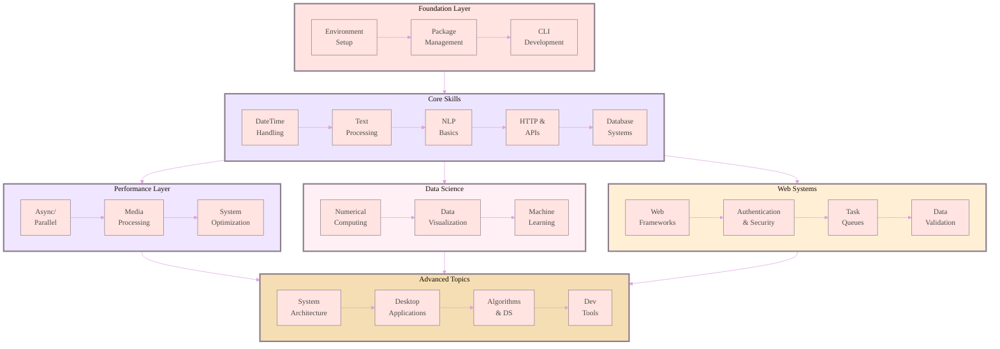

<h1 align="center"> My Python Journey </h1>

<!-- Advanced animated header with gradient background -->

## About This Repository

This repository documents my **100-day Python challenge** focused on **Data Science**, covering topics from **basic Python programming** to **advanced machine learning and data visualization**.  
Each day contains a Jupyter notebook or script with explanations, examples, and exercises to solidify learning.

---

Learning Path Overview
- *Days 1-25*: *Python Basics* — syntax, data types, control flow, functions, and file handling
- *Days 26-50*: *Intermediate* — NumPy, Pandas, data visualization, OOP, and APIs
- *Days 51-75*: *Advanced* — machine learning algorithms, NLP, deep learning, and model deployment
- *Days 76-100*: *Projects* — end-to-end data science projects, dashboards, and portfolio building
---

# Contributing
Contributions, suggestions, and feedback are welcome!
Please follow these steps to contribute:

- Fork the repository
- Create a new branch (git checkout -b feature/your-feature)
- Commit your changes (git commit -m 'Add some feature')
- Push to the branch (git push origin feature/your-feature)
- Open a Pull Request

---
## Architecture & Learning Path

## Complete Learning Route

<b style="color: #8B7D8B;">Phase I: Foundation Layer (Click to expand)</b>

<table style="width: 100%; background: linear-gradient(180deg, #FFE4E1 0%, #FFF0F5 100%); border-radius: 15px; padding: 20px;">
<tr>
<td width="5%" align="center" style="color: #8B7D8B; font-weight: bold;">01</td>
<td width="25%"><b style="color: #706B70;">Environment Management</b></td>
<td style="color: #4A4A4A;">

I evaluated conda, virtualenv, venv, pipenv, poetry, and PDM. Through extensive testing, I discovered venv + pip provides the best balance of simplicity and reliability for development, while uv excels in CI/CD pipelines. Includes performance comparisons and reproducibility tests.
</td>
</tr>
<tr style="background: rgba(237, 229, 255, 0.2);">
<td align="center" style="color: #8B7D8B; font-weight: bold;">02</td>
<td><b style="color: #706B70;">Package Distribution</b></td>
<td style="color: #4A4A4A;">

Publishing packages taught me the intricacies of wheels, sdists, and metadata. I benchmark build times, analyze distribution sizes, and explain why pyproject.toml is replacing setup.py. Real examples from packages I've published.
</td>
</tr>
<tr>
<td align="center" style="color: #8B7D8B; font-weight: bold;">03</td>
<td><b style="color: #706B70;">CLI Applications</b></td>
<td style="color: #4A4A4A;">

Click vs Typer vs argparse performance analysis with surprising results. I built the same CLI in each framework and measured startup time, memory usage, and developer experience. Includes advanced patterns for subcommands and configuration.
</td>
</tr>
</table>

<b style="color: #8B7D8B;">Phase II: Core Skills (Click to expand)</b>

<table style="width: 100%; background: linear-gradient(180deg, #EDE5FF 0%, #F0E6FF 100%); border-radius: 15px; padding: 20px;">
<tr>
<td width="5%" align="center" style="color: #8B7D8B; font-weight: bold;">04</td>
<td width="25%"><b style="color: #706B70;">DateTime Mastery</b></td>
<td style="color: #4A4A4A;">

Timezone bugs cost me a week of debugging in production. Now I test everything with pytz, pendulum, and zoneinfo. Includes DST edge cases, UTC best practices, and performance comparisons of datetime libraries.
</td>
</tr>
<tr style="background: rgba(240, 230, 255, 0.2);">
<td align="center" style="color: #8B7D8B; font-weight: bold;">05</td>
<td><b style="color: #706B70;">Text Processing</b></td>
<td style="color: #4A4A4A;">

Unicode nightmares and encoding errors at 3 AM. I document every text processing pitfall I've encountered, with benchmarks of regex vs string methods vs third-party libraries for common operations.
</td>
</tr>
<tr>
<td align="center" style="color: #8B7D8B; font-weight: bold;">06</td>
<td><b style="color: #706B70;">NLP Essentials</b></td>
<td style="color: #4A4A4A;">

spaCy vs NLTK vs Transformers head-to-head comparison. Memory profiling, speed benchmarks, and accuracy measurements for tokenization, NER, POS tagging, and embeddings.
</td>
</tr>
<tr style="background: rgba(255, 240, 245, 0.2);">
<td align="center" style="color: #8B7D8B; font-weight: bold;">07</td>
<td><b style="color: #706B70;">HTTP & APIs</b></td>
<td style="color: #4A4A4A;">

requests works until you need async. I compare requests, httpx, aiohttp, and urllib3 with real API calls, connection pooling strategies, and retry patterns that actually work in production.
</td>
</tr>
<tr>
<td align="center" style="color: #8B7D8B; font-weight: bold;">08</td>
<td><b style="color: #706B70;">Database Systems</b></td>
<td style="color: #4A4A4A;">

ORMs look elegant until you see the generated SQL. I profile SQLAlchemy, Django ORM, Peewee, and raw drivers. Includes N+1 query detection, connection pooling, and migration strategies.
</td>
</tr>
<tr style="background: rgba(245, 222, 179, 0.2);">
<td align="center" style="color: #8B7D8B; font-weight: bold;">09</td>
<td><b style="color: #706B70;">Concurrency Patterns</b></td>
<td style="color: #4A4A4A;">

The module that transformed my Python code. Real measurements of threading vs multiprocessing vs asyncio with production patterns for rate limiting, circuit breakers, and backpressure handling.
</td>
</tr>
<tr>
<td align="center" style="color: #8B7D8B; font-weight: bold;">10</td>
<td><b style="color: #706B70;">Media Processing</b></td>
<td style="color: #4A4A4A;">

Image and video processing without memory explosions. Pillow vs OpenCV vs scikit-image benchmarks, streaming processors, and GPU acceleration patterns.
</td>
</tr>
</table>

<b style="color: #8B7D8B;">Phase III: Data Science & ML (Click to expand)</b>

<table style="width: 100%; background: linear-gradient(180deg, #F0E6FF 0%, #FFF0F5 100%); border-radius: 15px; padding: 20px;">
<tr>
<td width="5%" align="center" style="color: #8B7D8B; font-weight: bold;">11</td>
<td width="25%"><b style="color: #706B70;">Numerical Computing</b></td>
<td style="color: #4A4A4A;">

NumPy internals revealed. Understanding memory layout, broadcasting, and vectorization improved my code's performance by 100x. Includes BLAS/LAPACK integration and GPU computing introduction.
</td>
</tr>
<tr style="background: rgba(255, 240, 245, 0.2);">
<td align="center" style="color: #8B7D8B; font-weight: bold;">12</td>
<td><b style="color: #706B70;">Data Visualization</b></td>
<td style="color: #4A4A4A;">

Matplotlib vs Plotly vs Altair vs Bokeh. I built identical visualizations in each to compare rendering speed, interactivity, file sizes, and developer experience.
</td>
</tr>
<tr>
<td align="center" style="color: #8B7D8B; font-weight: bold;">13</td>
<td><b style="color: #706B70;">Machine Learning</b></td>
<td style="color: #4A4A4A;">

From scikit-learn prototype to production deployment. Feature engineering pipelines, model versioning, A/B testing frameworks, and monitoring patterns that catch model drift.
</td>
</tr>
</table>

<b style="color: #8B7D8B;">Phase IV: Web Development (Click to expand)</b>

<table style="width: 100%; background: linear-gradient(180deg, #FFF0F5 0%, #FFEFD5 100%); border-radius: 15px; padding: 20px;">
<tr>
<td width="5%" align="center" style="color: #8B7D8B; font-weight: bold;">14</td>
<td width="25%"><b style="color: #706B70;">Web Frameworks</b></td>
<td style="color: #4A4A4A;">

FastAPI vs Flask vs Django performance shootout. I built the same API in each framework and measured throughput, latency percentiles, and resource usage under load.
</td>
</tr>
<tr style="background: rgba(255, 239, 213, 0.2);">
<td align="center" style="color: #8B7D8B; font-weight: bold;">15</td>
<td><b style="color: #706B70;">Authentication</b></td>
<td style="color: #4A4A4A;">

JWT, OAuth2, SAML, session management. Security patterns that actually protect applications, with penetration testing results and common vulnerability demonstrations.
</td>
</tr>
<tr>
<td align="center" style="color: #8B7D8B; font-weight: bold;">16</td>
<td><b style="color: #706B70;">Task Queues</b></td>
<td style="color: #4A4A4A;">

Celery vs RQ vs Huey vs Dramatiq. Performance under load, failure recovery patterns, and monitoring strategies. Real production configurations included.
</td>
</tr>
<tr style="background: rgba(245, 222, 179, 0.2);">
<td align="center" style="color: #8B7D8B; font-weight: bold;">17</td>
<td><b style="color: #706B70;">Data Validation</b></td>
<td style="color: #4A4A4A;">

Pydantic changed everything. Type safety, serialization, validation patterns that catch errors before production. Performance comparisons with marshmallow and cerberus.
</td>
</tr>
</table>

<b style="color: #8B7D8B;">Phase V: Quality & Performance (Click to expand)</b>

<table style="width: 100%; background: linear-gradient(180deg, #FFEFD5 0%, #F5DEB3 100%); border-radius: 15px; padding: 20px;">
<tr>
<td width="5%" align="center" style="color: #8B7D8B; font-weight: bold;">18</td>
<td width="25%"><b style="color: #706B70;">Testing Strategies</b></td>
<td style="color: #4A4A4A;">

pytest patterns that find real bugs. Property testing with Hypothesis, mutation testing, fixture strategies, and mocking patterns that don't break when code changes.
</td>
</tr>
<tr style="background: rgba(245, 222, 179, 0.2);">
<td align="center" style="color: #8B7D8B; font-weight: bold;">19</td>
<td><b style="color: #706B70;">Performance Optimization</b></td>
<td style="color: #4A4A4A;">

Profiling tools that actually help. cProfile, py-spy, memory_profiler, line_profiler in practice. Finding and fixing the 20% of code that uses 80% of resources.
</td>
</tr>
<tr>
<td align="center" style="color: #8B7D8B; font-weight: bold;">20</td>
<td><b style="color: #706B70;">Architecture Patterns</b></td>
<td style="color: #4A4A4A;">

Design patterns that survive requirement changes. Event sourcing, CQRS, hexagonal architecture, and dependency injection implemented and benchmarked.
</td>
</tr>
</table>

<b style="color: #8B7D8B;">Phase VI: Advanced Topics (Click to expand)</b>

<table style="width: 100%; background: linear-gradient(180deg, #F5DEB3 0%, #FFE4E1 100%); border-radius: 15px; padding: 20px;">
<tr>
<td width="5%" align="center" style="color: #8B7D8B; font-weight: bold;">21</td>
<td width="25%"><b style="color: #706B70;">Desktop Applications</b></td>
<td style="color: #4A4A4A;">

Modern GUIs that don't look dated. PyQt6 vs Tkinter vs Kivy vs Dear PyGui. Performance comparisons, distribution strategies, and native integration patterns.
</td>
</tr>
<tr style="background: rgba(255, 228, 225, 0.2);">
<td align="center" style="color: #8B7D8B; font-weight: bold;">22</td>
<td><b style="color: #706B70;">Algorithms & Data Structures</b></td>
<td style="color: #4A4A4A;">

When algorithmic thinking matters in Python. Performance comparisons of built-in vs custom implementations, with real-world applications.
</td>
</tr>
<tr>
<td align="center" style="color: #8B7D8B; font-weight: bold;">23</td>
<td><b style="color: #706B70;">Development Tools</b></td>
<td style="color: #4A4A4A;">

IDE configurations that boost productivity. Debugging techniques, profiling workflows, and automation scripts that save hours.
</td>
</tr>
</table>

---

<h3 style="color: #8B7D8B;">Built with persistence and curiosity</h3>

----------

<em>Crafted with ♥ by <strong>Kanak Baghel</strong> | <a href="https://www.linkedin.com/in/kanakbaghel">LinkedIn</a></em>

---
